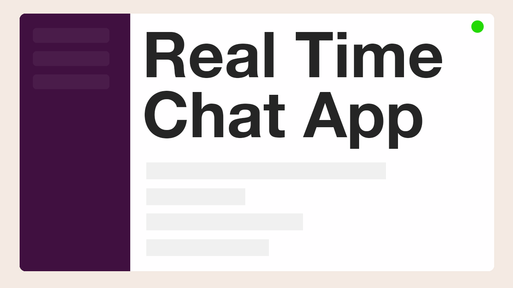

# Description

Source code for the reactjs client from the screencast <a href="https://youtu.be/BcWD-M2PJ-8" target="_blank">How to build a chat using Lambda + WebSocket + API Gateway? (nodejs)</a>

The backend lambda code is [here](https://github.com/alexkrkn/lambda-websocket-server)

# Run

- setup and run the [WebSocket](https://github.com/alexkrkn/lambda-websocket-server)
- copy the websocket url <a href="https://youtu.be/BcWD-M2PJ-8?t=1103">as described</a> in the video to [this constant](src/App.tsx#L4)
- run `npm run dev` 🚀

Don't forget to <a href="https://www.youtube.com/bitesizeacademy?sub_confirmation=1">subscribe</a>
